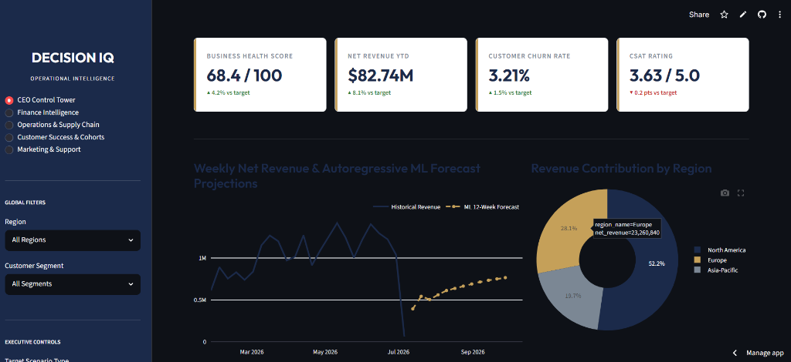
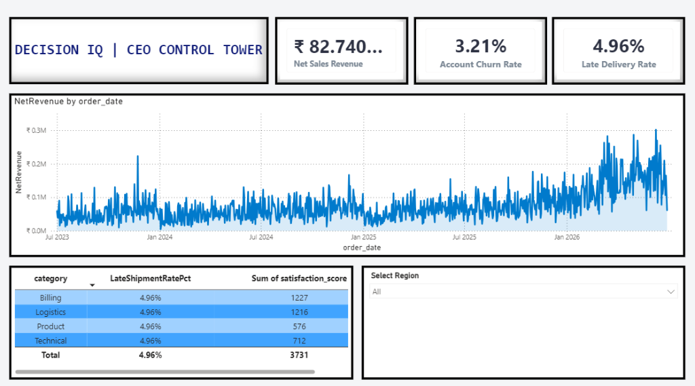
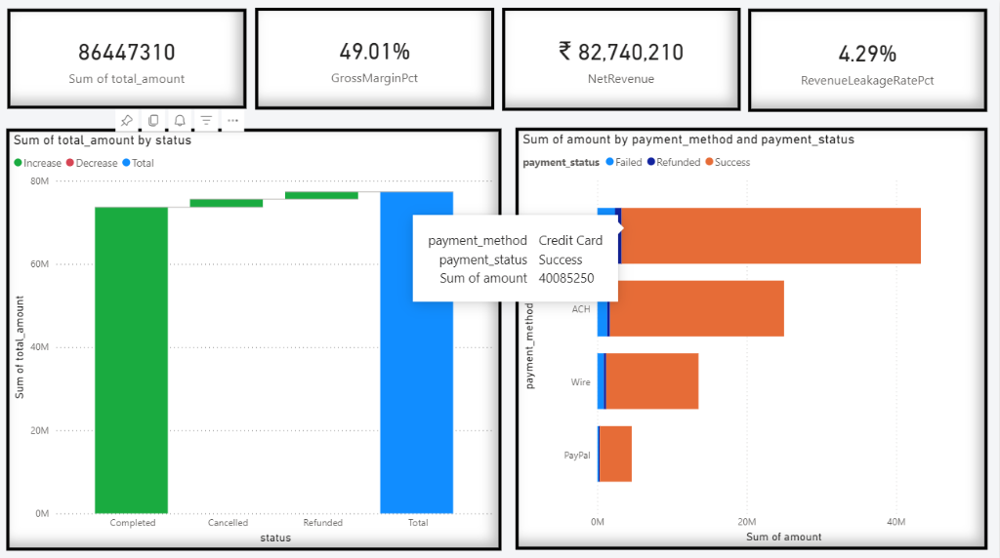
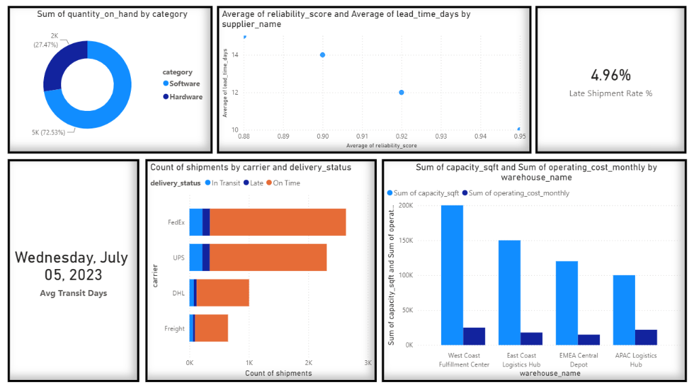
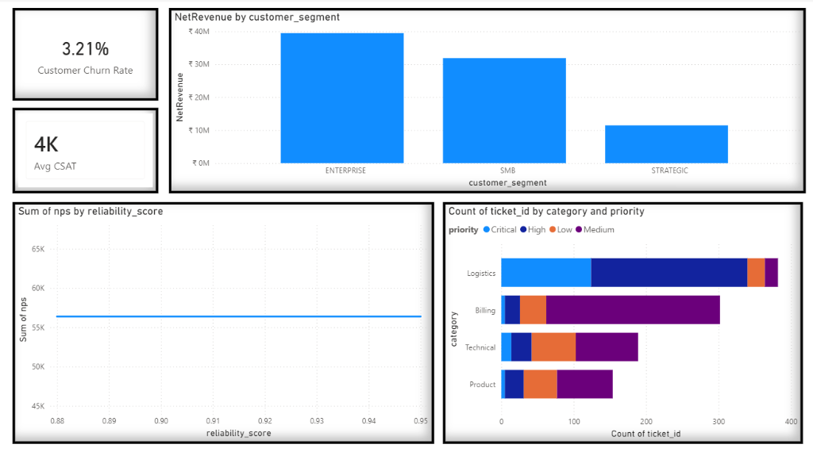

# DecisionIQ: Enterprise Operational Intelligence Platform



[](#tech-stack)
[](#power-bi-interactive-dashboard-suite)
[](#executive-aesthetics)

DecisionIQ is a production-grade enterprise analytics and operational intelligence platform. It integrates siloed data from Sales, Finance, Operations, Logistics, and Customer Success into a unified, normalized database to track corporate health, run machine learning forecasts, and generate automated root-cause diagnostics for executives.

---

## 📋 Executive Summary: The Business Scenario

### The Problem
In large enterprises, critical operational data is often siloed. When gross sales numbers drop:
*   The **CFO** sees margin compression but cannot trace it to logistics failures.
*   **Customer Success** notices a spike in churn and support tickets but lacks links to warehouse fulfillment delays.
*   **Logistics Managers** see late shipments but cannot identify which suppliers are violating SLA agreements.

### The Solution
DecisionIQ solves this by building a normalized star-schema data warehouse, auditing data quality with robust schemas, and training a predictive model suite. It features an automated **Insight Engine** that performs instant root-cause analysis:

> **Root-Cause Diagnostics Alert (Example):**
> *   **Anomalous Event:** Revenue in Q2 dropped 8.5% MoM due to a spike in customer support refunds.
> *   **Root Cause:** Component supply delays from vendor **Apex Technology Corp** delayed hardware assembly at the **West Coast Fulfillment Center**, resulting in a 55% late shipment rate.
> *   **Business Impact:** Logistics support tickets surged 3.5x, dropping average CSAT to 1.8/5.0 and leaking **$245,000** in refunded bookings.
> *   **Actionable Recommendation:** Reallocate 40% of future hardware purchase orders to **EuroChip AG**, shift safety stock reserves from the East Coast warehouse, and trigger email retention campaigns for at-risk accounts.

---

## 🚀 Key Platform Features

1. **Normalized Star-Schema ETL:** Processes and cleans over 50,000 records from relational dimensions and transactions.
2. **12-Scenario Data Simulation:** Simulates critical corporate events on-demand (e.g., *Cash Flow Crisis*, *Product Recall*, *Demand Spike*, *Competitor Price Cut*) to stress-test financial resilience and model mitigation paths.
3. **Self-Healing Schema Migrations:** Auto-detects legacy database structures upon launch, executing automated table drops and schema migrations to prevent startup crashes.
4. **Unified Machine Learning Suite:** Trains and registers predictive models (Revenue Forecasting, Churn Risk Classification, and Supplier Delay Probabilities).
5. **C-Suite Interactive Dashboard:** A custom-styled Streamlit web application using professional McKinsey/BCG design guidelines.

---

## 📊 Power BI Interactive Dashboard Suite

In addition to the Streamlit app, the project features a professional **4-page Power BI dashboard suite** mapped to the star-schema data warehouse. 

### Page 1: CEO Control Tower
*Tracks overall business health, monthly sales trends, and primary satisfaction scores.*


### Page 2: Finance Intelligence
*Analyzes gross-to-net conversions, gross margin variances, and payment processor transaction health.*


### Page 3: Operations & Logistics
*Monitors warehouse capacities, carrier delivery statistics, and supplier lead-time outliers.*


### Page 4: Customer Success & Cohorts
*Visualizes customer support ticket volumes by priority, customer LTV segmentations, and account churn risks.*


---

## 🛠️ Tech Stack

*   **Database:** Dual-Compatibility Connector (SQLite for local zero-config, PostgreSQL for production scaling)
*   **ORM / Database Interaction:** SQLAlchemy
*   **Data Wrangling:** Pandas & NumPy
*   **Machine Learning Suite:** Scikit-Learn (Random Forest & Ridge Regression models)
*   **Data Visualization:** Power BI Desktop & Plotly Express (Streamlit)
*   **Frontend Dashboard:** Streamlit (Python) with custom CSS injection

---

## 📂 Project Structure

```
Decision_IQ/
├── sql/
│   ├── schema.sql                 # Star-schema tables, relationships & unique indexes
│   └── advanced_analytics.sql     # Advanced SQL CTEs, window functions, cohort retention
├── etl/
│   ├── generator.py               # 3-year transactional synthetic data generation
│   ├── validator.py               # Data quality audits & range rules checks
│   ├── pipeline.py                # Pipeline runner (Extract, Clean, Transform, Load)
│   ├── scenario_manager.py        # Enterprise Scenario Manager registry
│   └── db_connector.py            # SQLAlchemy database connection factory
├── analytics/
│   ├── metrics.py                 # C-Suite KPI (Health Score, margin, leakage) aggregations
│   └── insight_engine.py          # Operational anomaly root-cause analyzer
├── ml/
│   ├── churn_model.py             # Random Forest classifier predicting account churn
│   ├── forecasting_model.py       # Ridge Regression weekly revenue forecaster
│   ├── supplier_risk_model.py     # Logistics delay probability classifier
│   └── train.py                   # Unified ML model trainer and evaluator
├── power_bi/
│   ├── README.md                  # Layout wireframes, navigation, and theme spec
│   ├── dax_reference.txt          # Production DAX measures (YoY growth, LTV, CSAT)
│   └── csv_exports/               # Excluded local folder containing CSV dumps for Power BI
├── python/
│   ├── app.py                     # Streamlit C-suite Control Tower dashboard
│   └── styles.css                 # Custom CSS stylesheet injection
├── docs/
│   ├── images/                    # Screenshot assets for README documentation
│   ├── BRD.md                     # Business Requirements Document (BRD)
│   ├── DATA_DICTIONARY.md         # Field-level database descriptions
│   ├── ARCHITECTURE.md            # Diagrammed ETL pipeline & model workflow
│   └── DEPLOYMENT_GUIDE.md        # Local & server installation manual
├── requirements.txt               # Dependencies listing
├── export_csv.py                  # Helper script to dump database tables to CSV for Power BI
├── run.py                         # CLI script to execute pipeline, train, and open app
└── README.md                      # General platform overview
```

---

## 🚀 Getting Started

Deploy and run the entire data and analytics suite with a single command:

```bash
# Clone and enter the project
git clone https://github.com/tanveersingh005/Decision_IQ.git
cd Decision_IQ

# Install dependencies
pip install -r requirements.txt

# Run the pipeline (generates database, trains ML models, and starts Streamlit dashboard)
python run.py
```
*For detailed cloud database server deployment guides, refer to the [Deployment Guide](docs/DEPLOYMENT_GUIDE.md).*
