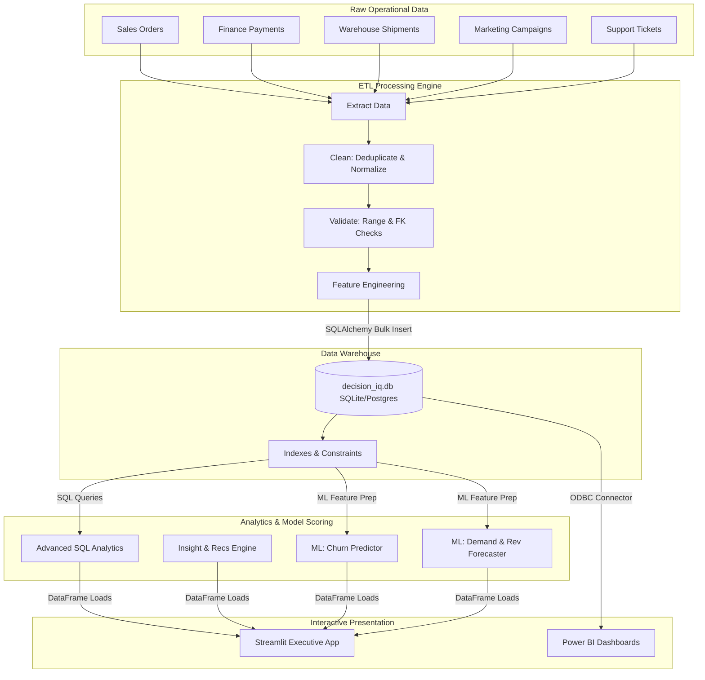

# System Architecture
## DecisionIQ Data & Analytics Infrastructure

This document outlines the technical design, data flows, and machine learning scoring pipelines of the DecisionIQ Enterprise Platform.

---

## 1. High-Level Data Flow

DecisionIQ processes raw operational data through a pipeline that cleans and validates transactions, computes business metrics, scores ML models, and presents interactive insights to the C-suite.

---

## 2. Component Descriptions

### A. ETL Pipeline & Data Quality Assurance
*   **Engine:** Built using Python Pandas, Polars, and SQLAlchemy.
*   **Validation Rules:** Injected via `etl/validator.py`. Every batch is scanned before loading.
    *   *Primary Keys:* Must be unique and non-null.
    *   *Referential Integrity:* Orders must reference a valid customer; shipments must reference valid suppliers/warehouses.
    *   *Logical Bounds:* Values like unit price, quantity, and discount cannot be negative.
*   **Cleaning Operations:** Customer email duplicates are removed by keeping the first chronological registration. String categories are standardized.

### B. Analytical Layer & Stored Logic
*   **Storage Engine:** SQLite (local default) / PostgreSQL.
*   **Database Constraints:** Configured in `sql/schema.sql` (foreign keys, checks, unique indexes).
*   **Analytical Queries:** Formulated in `sql/advanced_analytics.sql`. Uses recursive CTEs for personnel rollups, double-CTE structures for cohort retention, and quintile windows for customer RFM scores.

### C. Machine Learning Scoring Pipelines
*   **Training Schedule:** Triggered on demand or via a scheduler by running `ml/train.py`.
*   **Churn Pipeline:** Scans all active customer records, engineers RFM parameters and support ticket metrics, and outputs churn probability percentages.
*   **Forecasting Pipeline:** Aggregates weekly historical revenues, designs lag features and week-of-year seasonality components, and performs recursive multi-step forecasting to predict future sales trends.
*   **Model Storage:** Saved as binary serialization files (`.pkl`) under the `ml/models/` directory for instant, low-latency loading by the presentation dashboard.

### D. Presentation Layer
*   **Interactive Web Dashboard:** Written in Streamlit and Plotly. Utilizes custom CSS styles (`python/styles.css`) to enforce a minimalist, premium layout styled after executive consulting decks.
*   **Power BI Spec:** Configured for large enterprises connecting to the PostgreSQL data warehouse via ODBC, rendering role-based reports with cross-filtering.
